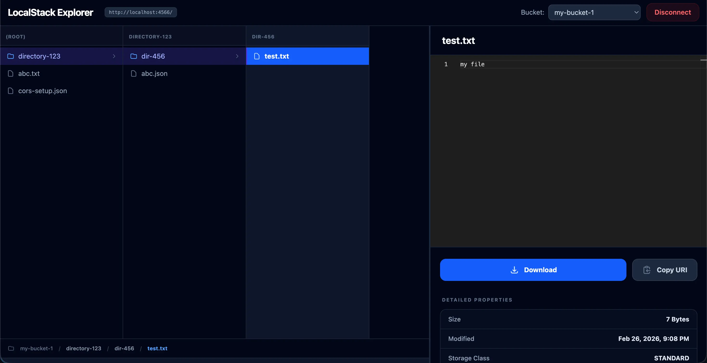

# 🪣 LocalStack Explorer [](https://github.com/vajahath/localstack-explorer/actions/workflows/deploy.yml) 

A modern, fast, and **privacy-focused** client-side UI for exploring LocalStack S3 buckets.

Use app here: [vajahath.github.io/localstack-explorer](https://vajahath.github.io/localstack-explorer/)



## CLI

```shell
npx localstack-explorer@latest --port=4200 --open

npx localstack-explorer@latest --help
```

## 🔒 Privacy & Security First

- **Offline & Serverless**: This application runs entirely in your browser. There is no middleman or backend server collecting your data.
- **Local Data Only**: All communication happens directly between your browser and your LocalStack endpoint (usually `localhost`).
- **No Data Leakage**: Your AWS credentials, bucket names, and file contents **never leave your system**.
- **Transparency**: Fully open-source and client-side, allowing you to audit how your data is handled.

## ✨ Features

- 📁 **Miller Column Navigation**: Intuitive multi-column layout for navigating through deeply nested S3 folders and objects.
- 🛡️ **100% Client-Side**: Runs entirely in your browser. No server-side component needed beyond your LocalStack instance.
- 📦 **S3 Object Management**: Browse buckets, list objects, and view detailed metadata with **Pagination Support** for large directories.
- 📤 **High-Performance Uploads**: Effortlessly upload files via **Drag & Drop** or header buttons. Supports **Bulk Uploads** and **S3 Multipart Upload** for large files with real-time progress tracking.
- 📂 **Folder Creation**: Create new S3 folders (directory prefixes) directly within any Miller column via an inline header UI.
- 🏷️ **Custom Metadata Editing**: Easily view, add, edit, and delete custom S3 object metadata via a fast, reactive inline editor.
- 💻 **Code Previews**: Integrated [Monaco Editor](https://microsoft.github.io/monaco-editor/) for high-quality syntax highlighting.
- 🗜️ **Smart Previews**: Automatically handles **GZIP decompression** in a background web worker for compressed log files or data.
- 🖼️ **Native Image Previews**: Instantly view high-resolution images (WebP, JPG, PNG) using highly-optimized, memory-efficient S3 Presigned URLs.
- 🧙 **Setup Wizard**: Easy configuration to connect to your local or remote LocalStack instance.
- 🎨 **Modern UI/UX**: Built with a "premium" feel, featuring dark mode support and smooth transitions.
- ⚡ **High Performance**: Leverages Angular Signals for efficient change detection and reactive state management.

## 🛠️ Tech Stack

- **Framework**: [Angular 21+](https://angular.dev/) (using Signals, Standalone Components, and Native Control Flow)
- **SDK**: [AWS SDK for JavaScript v3](https://aws.amazon.com/sdk-for-javascript/)
- **Editor**: [Monaco Editor](https://microsoft.github.io/monaco-editor/)
- **Styling**: [Tailwind CSS v4](https://tailwindcss.com/)
- **Testing**: [Vitest](https://vitest.dev/)

## 🚀 Getting Started

### 📋 Prerequisites

- [Node.js](https://nodejs.org/) (latest LTS recommended)
- [LocalStack](https://localstack.cloud/) running locally (e.g., via Docker)

### 💻 Installation

1. Clone the repository:
   ```bash
   git clone https://github.com/vajahath/localstack-explorer.git
   cd localstack-explorer
   ```

2. Install dependencies:
   ```bash
   npm install
   ```

3. Start the development server:
   ```bash
   npm start
   ```

4. Open your browser and navigate to `http://localhost:4200`.

## ⚙️ Configuration

When you first launch the app, use the **Setup Wizard** to configure:
- **Endpoint**: Usually `http://localhost:4566` for LocalStack.
- **Region**: Your default AWS region (e.g., `us-east-1`).
- **Credentials**: Access Key and Secret Key (LocalStack usually accepts `test`/`test`).

## 🧪 Development
### 🏃 Running Tests

To execute unit tests with Vitest:
```bash
npm test
```

### 🔁 Development (fast feedback loop)

This project separates the UI build from the lightweight CLI server that ships in `cli/`. During development you can run a continuous build that keeps the CLI's served files up-to-date so you can iterate quickly.

- `npm run watch:prod` — continuous production-style build that watches for changes and keeps the built UI in sync with the `cli/` folder. Internally this runs `ng build --watch` and the `scripts/watch-sync.mjs` helper to copy the build into `cli/`.
- CLI dev server: the CLI serves the built files from `cli/`. Run the CLI dev server to serve the latest build and optionally open the browser.

Recommended workflow (two terminals):

1. Install dependencies (only once):

```bash
npm install
```

2. Terminal A — continuous UI build + sync:

```bash
npm run watch:prod
```

3. Terminal B — start the CLI dev server (serves the `cli/` copy of the build):

```bash
cd cli
npm run start:dev
# or from the repo root: npm --prefix cli run start:dev
```

Now open the URL printed by the CLI (usually http://localhost:4200). Changes to the app will be rebuilt and synced into `cli/` automatically.

### 🐳 Running LocalStack with Docker Compose

If you want a quick LocalStack environment for testing, start the included Docker Compose stack:

```bash
docker-compose up -d
```

This launches LocalStack and other development helpers (see `docker-compose.yml`). Once LocalStack is running, use the Setup Wizard in the UI to point at `http://localhost:4566` (default LocalStack endpoint).

### 🏁 Quick restart checklist (returning after weeks)

When you come back to the project and want to pick up where you left off, follow these steps:

1. Start LocalStack (if you use Docker):

```bash
docker-compose up -d
```

2. Ensure dependencies are installed:

```bash
npm install
```

3. Start the file watcher that builds and syncs into `cli/`:

```bash
npm run watch:prod
```

4. Start the CLI dev server (in a second terminal):

```bash
cd cli
npm run start:dev
# or: npm --prefix cli run start:dev
```

5. Open the CLI URL (usually `http://localhost:4200`) and run the Setup Wizard to connect to `http://localhost:4566`.

Notes:
- The root `build` script will create a production bundle and copy it to `cli/` (`npm run build`).
- If you prefer to run the published CLI package, you can use `npx localstack-explorer@latest --port=4200 --open`.

### 🏗️ Building for Production

To create a production-ready bundle:
```bash
npm run build
```
The artifacts will be stored in the `dist/` directory and a copy is placed under `cli/` for the CLI to serve.

### 🚀 Deployment

Deployment is automated via GitHub Actions and is triggered when a new GitHub Release is published.

The workflow (`.github/workflows/deploy.yml`) performs the following:
- Builds and deploys the UI to GitHub Pages
- Publishes the CLI package to npm

To deploy a new version:
1. Create and publish a GitHub Release
2. The CI pipeline will automatically build, test, and deploy both the Pages site and CLI package

## 📄 License

This project is licensed under the MIT License.
